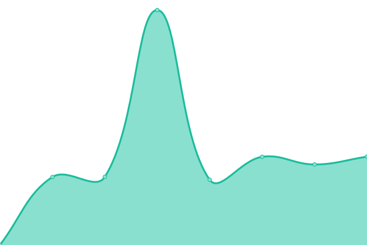
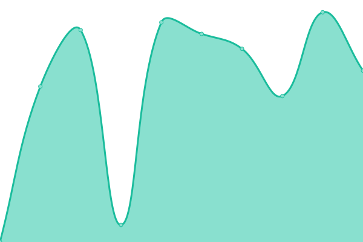
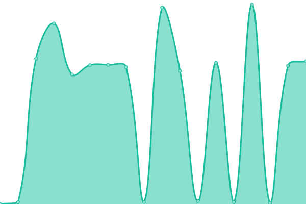
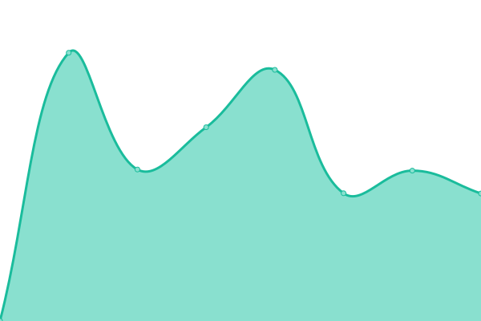

# [📈 Live Status](https://dani.github.io/up): <!--live status--> **🟧 Partial outage**

This repository contains the open-source uptime monitor and status page for [Daniel Berteaud](https://www.ehtrace.com), powered by [Upptime](https://github.com/upptime/upptime).

With [Upptime](https://upptime.js.org), you can get your own unlimited and free uptime monitor and status page, powered entirely by a GitHub repository. We use [Issues](https://github.com/dani/up/issues) as incident reports, [Actions](https://github.com/dani/up/actions) as uptime monitors, and [Pages](https://dani.github.io/up) for the status page.

<!--start: status pages-->
<!-- This summary is generated by Upptime (https://github.com/upptime/upptime) -->
<!-- Do not edit this manually, your changes will be overwritten -->
<!-- prettier-ignore -->
| URL | Status | History | Response Time | Uptime |
| --- | ------ | ------- | ------------- | ------ |
|  [Rama Sakti](https://www.ramasakti.com) | 🟩 Up | [rama-sakti.yml](https://github.com/danichrisd/up/commits/HEAD/history/rama-sakti.yml) | 

 618ms
     
 | 

<a href="https://danichrisd.github.io/up/history/rama-sakti">100.00%</a>
    

|  [WA](http://103.150.92.1:1680/) | 🟥 Down | [wa.yml](https://github.com/danichrisd/up/commits/HEAD/history/wa.yml) | 

 0ms
     
 | 

<a href="https://danichrisd.github.io/up/history/wa">0.00%</a>
    

|  [Ramen Katsu](https://systemalpha.net/ramenkatsu) | 🟩 Up | [ramen-katsu.yml](https://github.com/danichrisd/up/commits/HEAD/history/ramen-katsu.yml) | 

 4606ms
     
 | 

<a href="https://danichrisd.github.io/up/history/ramen-katsu">99.91%</a>
    

|  [LABEL](https://systemalpha.net/label) | 🟩 Up | [label.yml](https://github.com/danichrisd/up/commits/HEAD/history/label.yml) | 

 4435ms
     
 | 

<a href="https://danichrisd.github.io/up/history/label">99.74%</a>
    

|  [Rama-Backend](https://systemalpha.net/ramasakti) | 🟩 Up | [rama-backend.yml](https://github.com/danichrisd/up/commits/HEAD/history/rama-backend.yml) | 

 3652ms
     
 | 

<a href="https://danichrisd.github.io/up/history/rama-backend">99.58%</a>
    

<!--end: status pages-->

[**Visit our status website →**](https://dani.github.io/up)

## 📄 License

- Powered by: [Upptime](https://github.com/upptime/upptime)
- Code: [MIT](./LICENSE) © [Daniel Berteaud](https://www.ehtrace.com)
- Data in the `./history` directory: [Open Database License](https://opendatacommons.org/licenses/odbl/1-0/)
