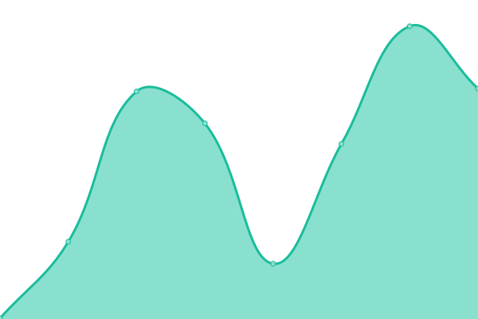

# [📈 Live Status](https://dani.github.io/up): <!--live status--> **🟧 Partial outage**

This repository contains the open-source uptime monitor and status page for [Daniel Berteaud](https://www.ehtrace.com), powered by [Upptime](https://github.com/upptime/upptime).

With [Upptime](https://upptime.js.org), you can get your own unlimited and free uptime monitor and status page, powered entirely by a GitHub repository. We use [Issues](https://github.com/dani/up/issues) as incident reports, [Actions](https://github.com/dani/up/actions) as uptime monitors, and [Pages](https://dani.github.io/up) for the status page.

<!--start: status pages-->
<!-- This summary is generated by Upptime (https://github.com/upptime/upptime) -->
<!-- Do not edit this manually, your changes will be overwritten -->
<!-- prettier-ignore -->
| URL | Status | History | Response Time | Uptime |
| --- | ------ | ------- | ------------- | ------ |
|  [Rama Sakti](https://www.ramasakti.com) | 🟩 Up | [rama-sakti.yml](https://github.com/danichrisd/up/commits/HEAD/history/rama-sakti.yml) | 

 680ms
     
 | 

<a href="https://dani.github.io/up/history/rama-sakti">100.00%</a>
    

|  [WA](http://178.128.124.119:8000/) | 🟩 Up | [wa.yml](https://github.com/danichrisd/up/commits/HEAD/history/wa.yml) | 

 444ms
     
 | 

<a href="https://dani.github.io/up/history/wa">100.00%</a>
    

|  [Hacker News](https://news.ycombinator.com) | 🟩 Up | [hacker-news.yml](https://github.com/danichrisd/up/commits/HEAD/history/hacker-news.yml) | 

 461ms
     
 | 

<a href="https://dani.github.io/up/history/hacker-news">100.00%</a>
    

|  [Test Broken Site](https://thissitedoesnotexist.koj.co) | 🟥 Down | [test-broken-site.yml](https://github.com/danichrisd/up/commits/HEAD/history/test-broken-site.yml) | 

 0ms
     
 | 

<a href="https://dani.github.io/up/history/test-broken-site">100.00%</a>
    

<!--end: status pages-->

[**Visit our status website →**](https://dani.github.io/up)

## 📄 License

- Powered by: [Upptime](https://github.com/upptime/upptime)
- Code: [MIT](./LICENSE) © [Daniel Berteaud](https://www.ehtrace.com)
- Data in the `./history` directory: [Open Database License](https://opendatacommons.org/licenses/odbl/1-0/)
